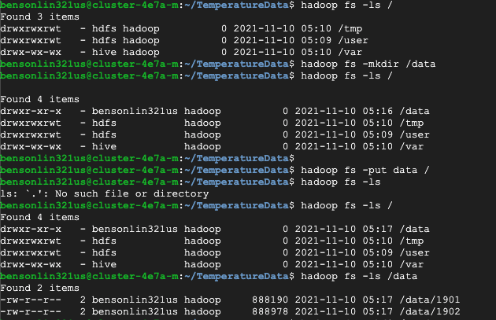
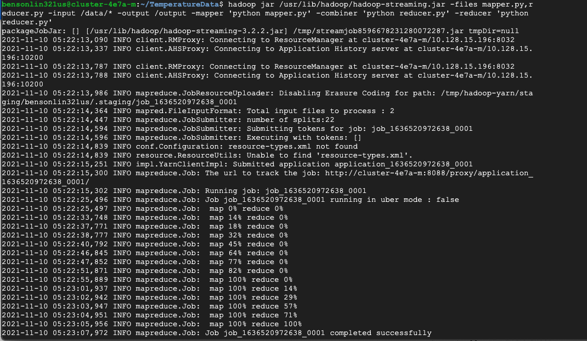
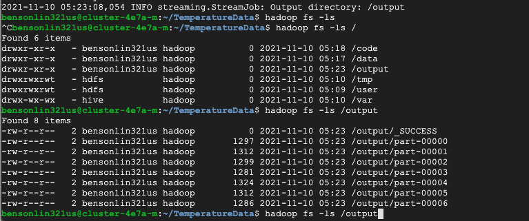
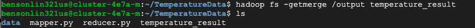
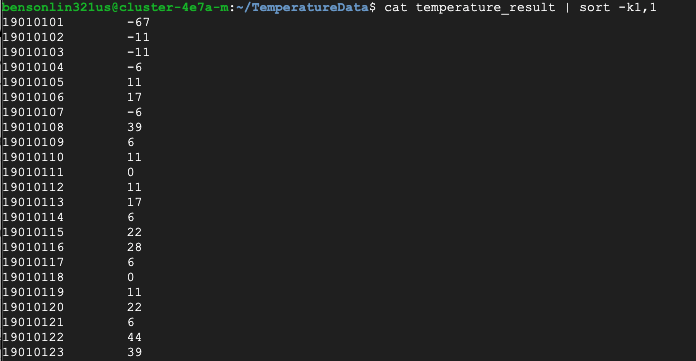
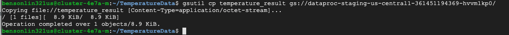
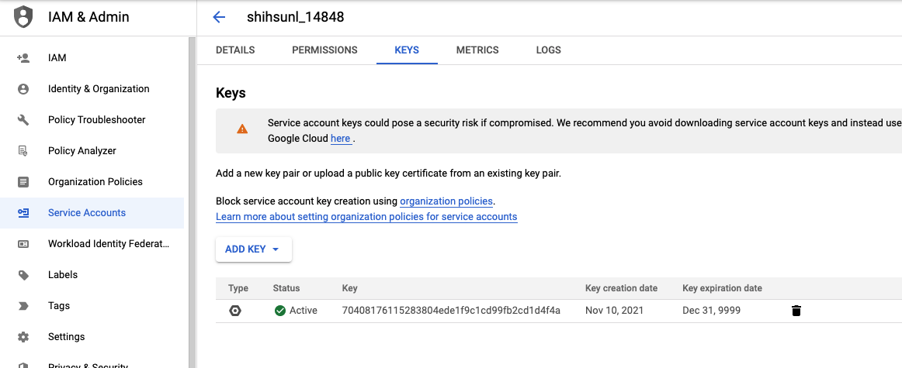
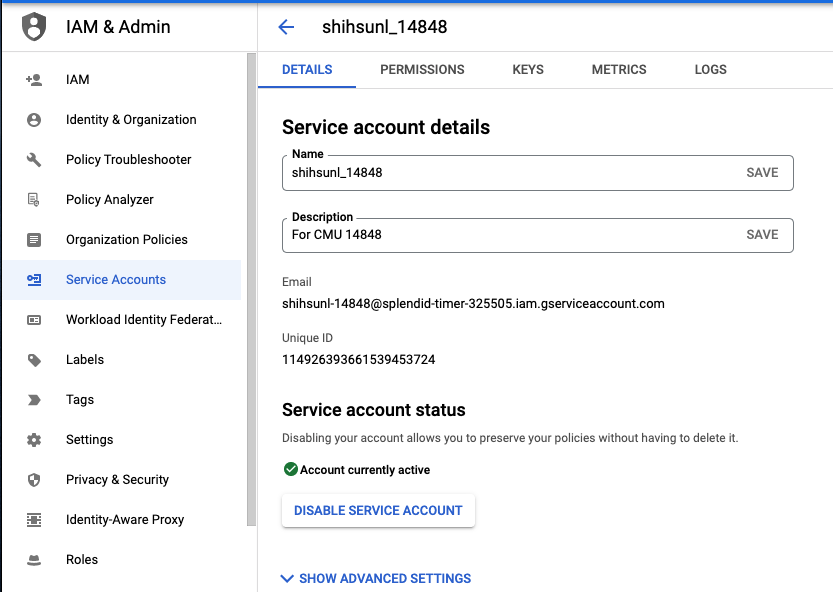
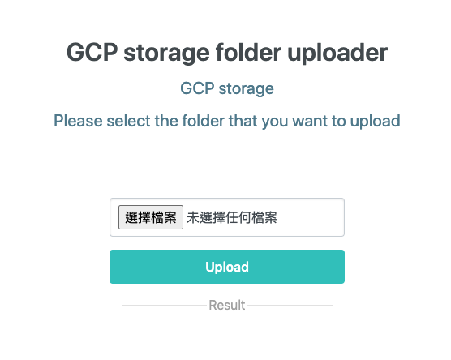
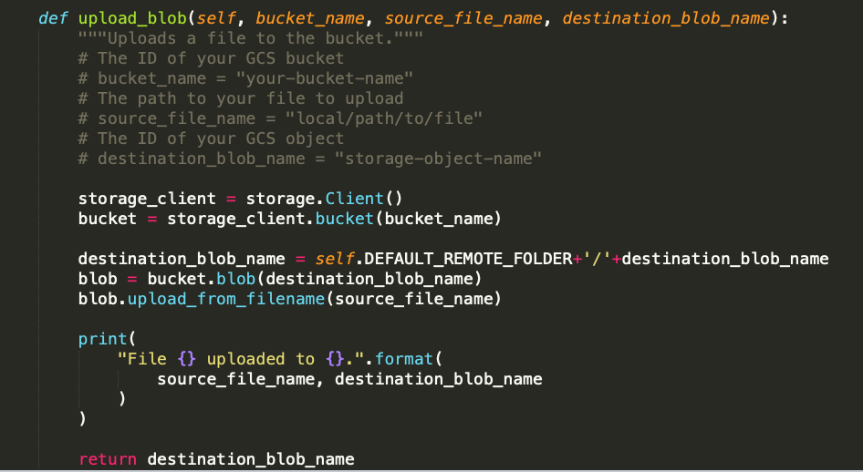

# 14848_Cloud_Infra_HW4
14848_Cloud_Infra_HW4

### Prepare input data


### Run mapreduce


### List output files


### Merge output files


### Print merged output file


### Copy merged output to bucket

- Then, you can download result from the GCP bucket

### Extra Credit
- Video: https://www.youtube.com/watch?v=xA_9fQ-ouAc

- Step1: First, you need to create your GCP credentials and export the credential file path to the environment variable.



```
export GOOGLE_APPLICATION_CREDENTIALS="/Users/bensonlin/Project/CMU/14848_Cloud_Infra/A4/key_for_uploading/splendid-timer-325505-704081761152.json"
``` 

- Step2: Execute the API server and then you can upload a folder
```
python3 app.py
```


- Here's the upload function
You can check util/google_storage_util.py to get more details.


